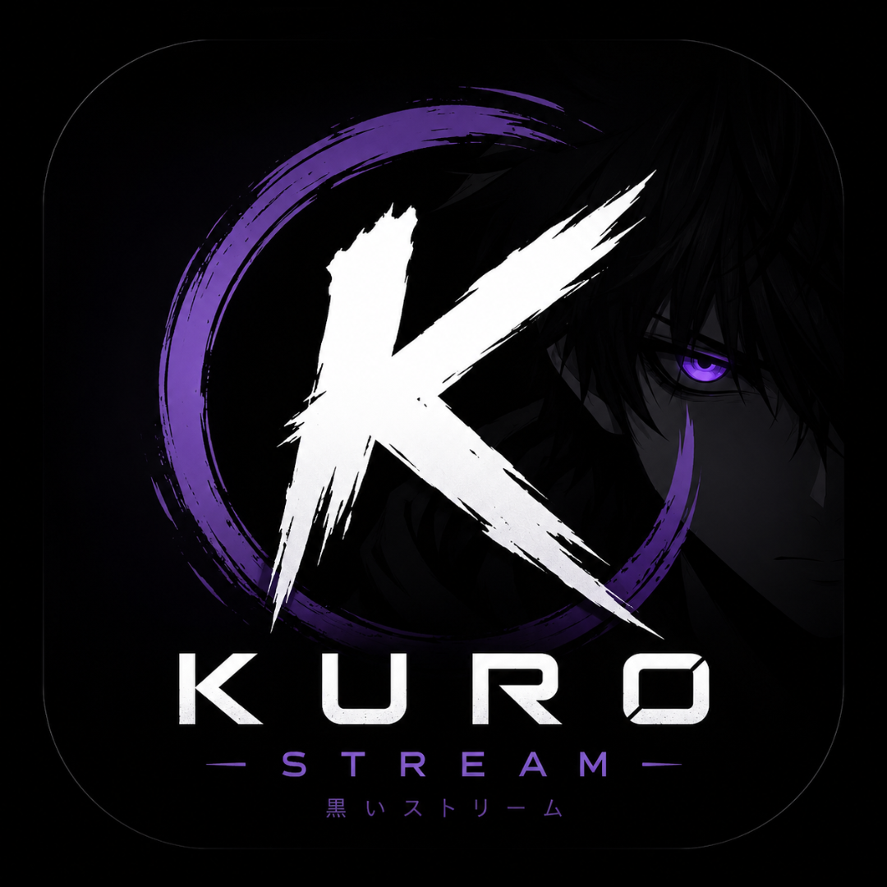
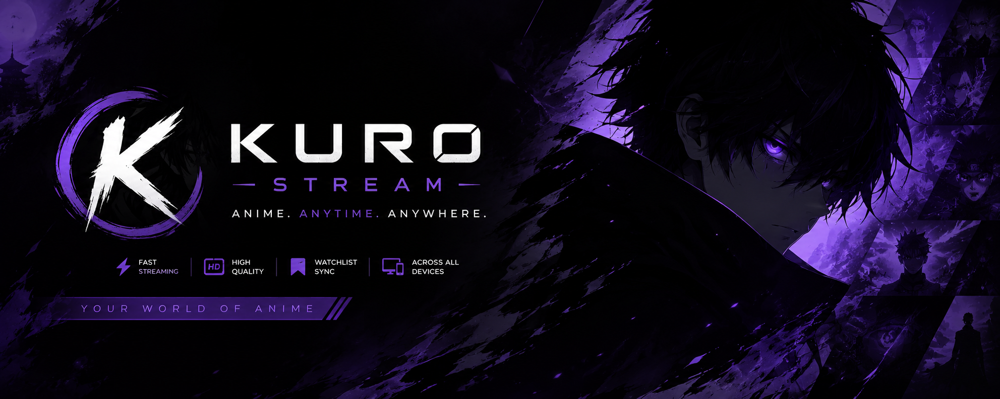

<div align="center">



# KuroStream



**Anime. Anytime. Anywhere.**

[](https://www.gnu.org/licenses/gpl-3.0)
[](https://developer.android.com/tv)
[](https://kotlinlang.org/)
[](https://developer.android.com/jetpack/compose)
[](https://developer.android.com/studio/releases/platforms)

A premium anime streaming platform for Android TV, Google TV, Fire TV, and mobile devices. Built with Arctic Fuse 3 design language, enterprise-grade playback, and an open extension ecosystem.

[Features](#-features) · [Screenshots](#-screenshots) · [Download](#-download) · [Build](#-build) · [Contributing](CONTRIBUTING.md) · [Security](SECURITY.md)

</div>

---

## ✨ Features

### 🎨 Arctic Fuse 3 UI
- Premium TV-first interface with cinematic hero banners
- Dynamic color extraction from poster artwork
- Smooth focus animations with glow effects
- Left navigation rail with collapsed/expanded states
- TV-safe overscan margins
- Perfect D-pad navigation
- Rich gradients and layered depth
- Blur backdrops with animated transitions

### 📺 Playback Excellence
| Feature | Status |
|---------|--------|
| Media3 ExoPlayer | ✅ |
| libmpv backend | ✅ |
| libVLC backend | ✅ |
| Auto backend selection | ✅ |
| HDR10 / HDR10+ / Dolby Vision | ✅ |
| Dolby Atmos / DTS / TrueHD | ✅ |
| Audio passthrough | ✅ |
| Subtitle styling & delay | ✅ |
| Intro/Outro skip | ✅ |
| Resume & Continue Watching | ✅ |
| Frame pacing & refresh rate match | ✅ |
| Adaptive bitrate | ✅ |

### 🔌 Extension Ecosystem
- **Stremio** addon manifest support
- **Cloudstream** provider bridge
- **Kodi** repository style addons
- **Jellyfin** plugin bridge
- **Plex** metadata bridge
- **Emby** metadata bridge
- Plugin SDK with sandbox isolation
- Signature verification
- Dependency resolution
- Automatic updates
- Health checks & analytics

### 🌐 Metadata Pipeline
- **AniList** — trending, seasonal, search
- **MyAnimeList** — ratings, reviews
- **Jikan** — detailed anime data
- **TMDB** — movies & OVAs
- **Kitsu** — community ratings
- Offline cache with Room
- Smart refresh
- Cross-source merging

### ☁️ Cross-Device Sync
- Watch history
- Continue watching
- Favorites & watchlists
- Playback position
- Settings sync
- Purchased entitlements
- Offline restore
- Conflict resolution

### 🛒 Marketplace
- Premium skins (Arctic Fuse, AMOLED, Ocean Blue, Forest Green, Cherry Blossom, Starry Night)
- Premium addons
- Stripe checkout
- QR-based purchase restore
- Offline entitlement cache
- Firestore purchase sync

### 🎯 Performance
| Scenario | Memory Target |
|----------|--------------|
| Idle | < 25 MB |
| 1080p playback | < 50 MB |
| 4K playback | < 80 MB |
| 4K + AI upscaling + Atmos | < 125 MB |

- Adaptive memory governor
- Object pooling
- Zero-copy decoding
- Bitmap reuse
- Lazy loading
- Background work cancellation

### 📱 Platform Support
- Android TV
- Google TV
- Fire TV
- NVIDIA Shield
- Chromecast with Google TV
- Tablets
- Phones
- ChromeOS
- LG webOS (bridge)
- Samsung Tizen (bridge)

---

## 📸 Screenshots

> Screenshots will be added after release.

---

## ⬇️ Download

### Latest Release
[](https://github.com/OtakuCompiler/KuroStream-Stabilized/releases)

### Sideload
```bash
# Fire TV / Android TV
adb install kurostream-tv-release.apk

# Phone / Tablet
adb install kurostream-mobile-release.apk
```

---

## 🔨 Build

### Prerequisites
- Android Studio Hedgehog (2023.1.1) or newer
- JDK 17
- Android SDK 35
- NDK (for MPV/VLC native libraries)

### Clone & Build
```bash
git clone https://github.com/OtakuCompiler/KuroStream-Stabilized.git
cd KuroStream-Stabilized

# Add API keys (optional, for full metadata)
echo "anilist.client_id=YOUR_ANILIST_ID" >> local.properties
echo "mal.client_id=YOUR_MAL_ID" >> local.properties

# Build debug
./gradlew assembleDebug

# Build release (requires signing config)
./gradlew assembleRelease
```

### Modules
```
app/          — Main application (UI, navigation, TV entry)
common/       — Shared utilities, memory management, optimization
core-common/  — KMP common code (models, dispatchers)
core-platform/— KMP platform abstractions
data/         — Repositories, Room, Retrofit, DataStore
domain/       — Use cases, entity definitions, result types
playback/     — Media3, MPV, VLC players, renderers, buffers
plugin-sdk/   — Extension SDK, manifest parsing, sandbox
extensions/   — Stremio, Cloudstream, Kitsu bridges
marketplace/  — Purchase flow, entitlement management
torrent/      — P2P streaming engine
cache/        — Multi-layer caching
ui/           — Shared Compose components
launcher/     — TV launcher integration
backup/       — Settings & data backup
benchmark/    — Performance benchmarks
```

---

## 🏗️ Architecture

```
┌─────────────────────────────────────────────────────────────┐
│                         APP LAYER                           │
│  Arctic Fuse 3 UI  ·  Navigation  ·  ViewModels  ·  DI    │
├─────────────────────────────────────────────────────────────┤
│                       DOMAIN LAYER                          │
│  Use Cases  ·  Repository Interfaces  ·  Entity Models      │
├─────────────────────────────────────────────────────────────┤
│                        DATA LAYER                           │
│  Repositories  ·  Room  ·  Retrofit  ·  DataStore  ·  Cache│
├─────────────────────────────────────────────────────────────┤
│                     PLATFORM LAYER                          │
│  Media3  ·  MPV  ·  VLC  ·  Torrent  ·  Extension SDK       │
└─────────────────────────────────────────────────────────────┘
```

**Clean Architecture** with Hilt DI, Kotlin Coroutines, Flow, and Jetpack Compose.

---

## 🔒 Security

- ✅ Certificate pinning for API endpoints
- ✅ Encrypted Proto DataStore
- ✅ Plugin sandbox with ClassLoader isolation
- ✅ Extension signature verification
- ✅ Network Security Config (cleartext disabled in release)
- ✅ ProGuard/R8 obfuscation

See [SECURITY.md](SECURITY.md) for vulnerability reporting.

---

## 🤝 Contributing

We welcome contributions! Please read [CONTRIBUTING.md](CONTRIBUTING.md) for guidelines.

### Quick Start
```bash
# Fork & clone
git clone https://github.com/YOUR_USERNAME/KuroStream-Stabilized.git

# Create branch
git checkout -b feature/my-improvement

# Commit & push
git commit -m "feat: add amazing feature"
git push origin feature/my-improvement

# Open Pull Request
```

---

## 📜 License

KuroStream is licensed under the **GNU General Public License v3.0**.

```
KuroStream — Premium Anime Streaming Platform
Copyright (C) 2024-2026 OtakuCompiler

This program is free software: you can redistribute it and/or modify
it under the terms of the GNU General Public License as published by
the Free Software Foundation, either version 3 of the License, or
(at your option) any later version.
```

See [LICENSE](LICENSE) for full text.

---

## 🙏 Acknowledgements

- [Arctic Fuse 3](https://github.com/jurialmunkey/skin.arctic.fuse.2) — Design inspiration
- [Jetpack Compose for TV](https://developer.android.com/training/tv/playback/compose) — TV UI framework
- [Media3](https://developer.android.com/media/media3) — Playback foundation
- [MPV](https://mpv.io/) / [libVLC](https://www.videolan.org/vlc/libvlc.html) — Native playback engines
- [AniList](https://anilist.co/) / [MyAnimeList](https://myanimelist.net/) / [Jikan](https://jikan.moe/) — Metadata sources
- [Stremio](https://www.stremio.com/) / [Cloudstream](https://github.com/recloudstream/cloudstream) — Extension inspiration

---

<div align="center">

**Made with ❤️ for the anime community**

[⭐ Star this repo](https://github.com/OtakuCompiler/KuroStream-Stabilized) · [🐛 Report Bug](https://github.com/OtakuCompiler/KuroStream-Stabilized/issues) · [💡 Request Feature](https://github.com/OtakuCompiler/KuroStream-Stabilized/issues)

</div>
